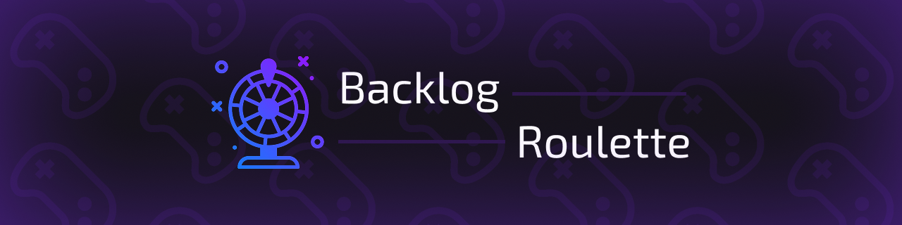

# 🎲 BacklogRoulette

<p align="center">
  
</p>

<p align="center">
  <a href="https://flutter.dev">
    
  </a>
  <a href="https://riverpod.dev">
    
  </a>
  <a href="https://firebase.google.com">
    
  </a>
</p>

<h3 align="center">Kill your backlog, kill your back pain.</h3>

---

## 🚀 About the Project

**BacklogRoulette** is a Flutter app developed to solve the classic modern gamer's dilemma: having a huge library and not knowing what to play.

Unlike a simple random draw, the app uses an **intelligent filter system called 'Moods'**. The user selects their current mood, and the algorithm weighs the games in the library that match that "vibe," ensuring that the roulette suggests the perfect game for the moment, while still keeping that chaotic randomness.

> **Note:** This project was developed with a focus on high performance, modern UI with smooth animations, and a scalable architecture.

---

## 📸 Demonstration

<table style="width: 100%; border-collapse: collapse; text-align: center;">
  <thead>
    <tr>
      <th style="border: 1px solid #ddd; padding: 8px;">Home Screen</th>
      <th style="border: 1px solid #ddd; padding: 8px;">Roulette</th>
      <th style="border: 1px solid #ddd; padding: 8px;">Settings</th>
    </tr>
  </thead>
  <tbody>
    <tr>
      <td style="border: 1px solid #ddd; padding: 8px;">
        
      </td>
      <td style="border: 1px solid #ddd; padding: 8px;">
        
      </td>
      <td style="border: 1px solid #ddd; padding: 8px;">
        
      </td>
    </tr>
  </tbody>
</table>

---

## ✨ Main Features

- **⚡ Enhanced User Experience (UX):** 100% animated UI, focusing on smooth transitions (_Hero animations_) and _Haptic Feedback_ for a tactile and satisfying touch.
- **🧠 "Moods" Algorithm:** Smart filters that match the player's mood with game styles.
- **🔗 Multiverse Integration (API Mashup):** Deep integration with **Steam API** to import the library and **IGDB API** for rich metadata (covers, genres, descriptions).
- **🌐 Global Localization:** Support for 6 languages (PT, PT-BR, EN, ZH, FR, ES) using the official `l10n` package.
- **🔒 Secure Authentication:** Easy login with Firebase Auth.

---

## 🛠️ Stack

The app uses state-of-the-art Flutter development:

- **UI/Core:** Flutter
- **State Management & DI:** `riverpod`
- **Data Modeling & Immutability:** `freezed` (with pattern matching to ensure code safety).
- **Backend & Cache:** Firebase (Auth & Firestore).
- **Local Persistence:** `isar` (Planned for offline caching of games and settings).
- **APIs:** Steam API & IGDB API.

---

## 🏗️ Arquitetura e Estrutura

O projeto adota uma abordagem **Feature-First** híbrida com **MVVM** e **Clean Architecture**, garantindo desacoplamento e facilidade de manutenção.

```text
lib/
├── core/
│   ├── di/
│   ├── firebase/
│   ├── l10n/
│   ├── router/
│   └── themes/
├── features/
│   ├── auth/
│   │   ├── data/
│   │   ├── domain/
│   │   └── presentation/
│   ├── games/
│   │   ├── data/
│   │   ├── domain/
│   │   └── presentation/
│   ├── home/
│   │   └── presentation/
│   └── settings/
│       ├── domain/
│       └── presentation/
└── main.dart
```

## 🧠 Data Strategy (Cross-Referencing)

To optimize API performance and cost, the app uses a caching strategy in Firestore:

1. The app retrieves the Steam `appId`.
2. Queries **IGDB** using external reference fields (fallback via game name).
3. Automatically filters out demos, playtests, and alphas.
4. Cross-references the data and saves it in **Firestore**.
5. Subsequent requests use the Firestore cache, making the app extremely fast.

---

## ⚙️ How to Run

1. Clone the repository:
```bash
git clone [https://github.com/pedrokGs/BacklogRoulette.git](https://github.com/pedrokGs/BacklogRoulette.git)
```
2. Install the dependencies:
```bash
flutter pub get
```
3. Configure Firebase in the project (requires `google-services.json` file).
4. Add the Steam and IGDB API keys as shown in .env.example.
5. Run the app:
```bash
flutter run
```
